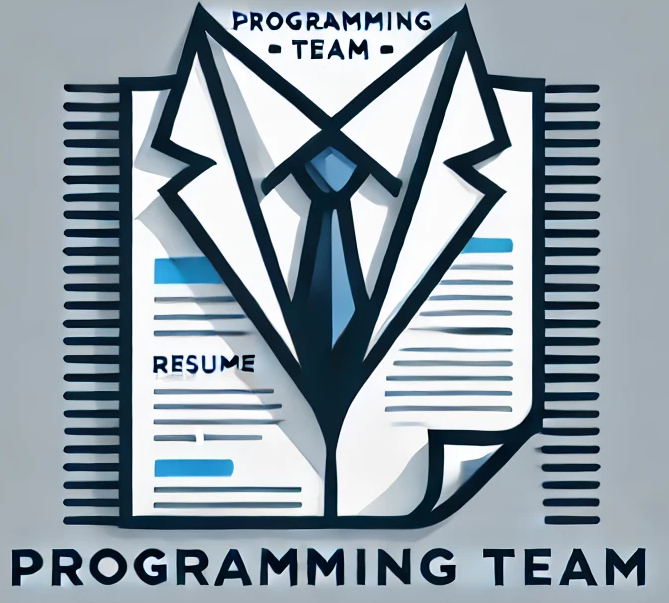

# Programming.Team: AI-Powered Resume Tailor

**Programming.Team** is a cutting-edge application designed to help job seekers create tailored resumes optimized for specific job descriptions. Leveraging the power of artificial intelligence, our tool analyzes job postings and suggests personalized improvements to your resume, ensuring it stands out to recruiters and applicant tracking systems (ATS).

## Features

- **Job Description Analysis**: Upload a job description, and our AI will extract key skills, qualifications, and keywords.
- **Resume Optimization**: Get tailored suggestions to align your resume with the job requirements.
- **ATS Compatibility**: Ensure your resume passes through Applicant Tracking Systems with ease.
- **Personalized Recommendations**: Receive actionable advice on improving your resume's content, structure, and formatting.
- **Multi-Industry Support**: Tailor your resume for various industries and roles.
- **User-Friendly Interface**: Intuitive and easy-to-use design for a seamless experience.

## How It Works

1. **Upload Your Resume**: Start by uploading your current resume in PDF or DOCX format.
2. **Provide Job Description**: Paste or upload the job description you're targeting.
3. **AI Analysis**: Our AI analyzes the job description and compares it with your resume.
4. **Get Tailored Result**: Receive optimized version of your resume.
5. **Download Your Resume**: Export your polished, job-specific resume and apply with confidence.

## License

This project is licensed under the MIT License. See the [LICENSE](LICENSE.txt) file for details.

## Acknowledgments

- Special thanks to [OpenAI](https://openai.com) for their powerful language models.

## Contact

For questions or feedback, please reach out to us at [jason@groundbreaker.solutions](mailto:jason@groundbreaker.solutions).
